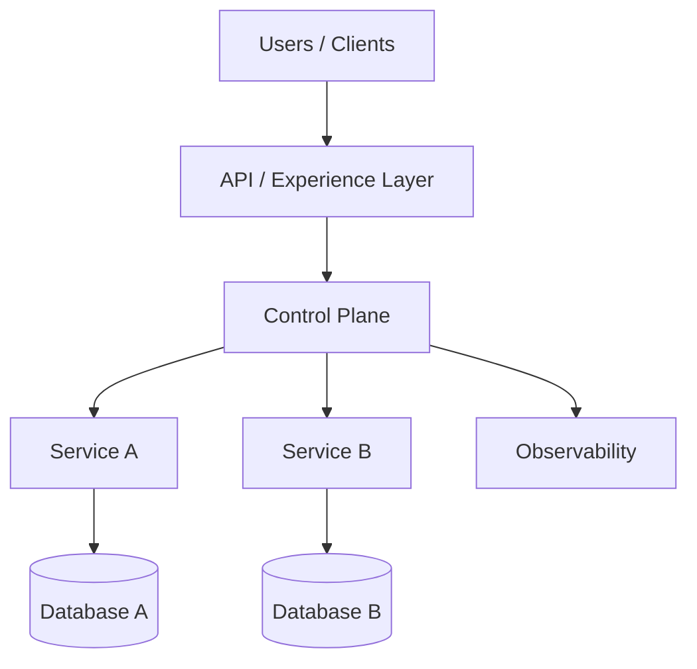
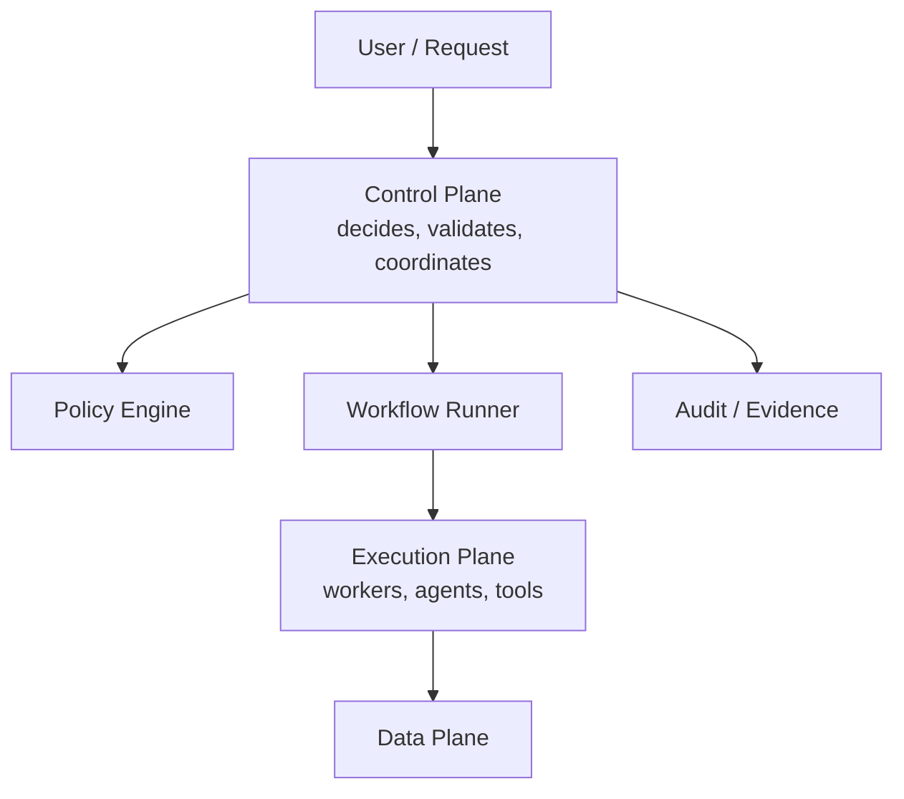
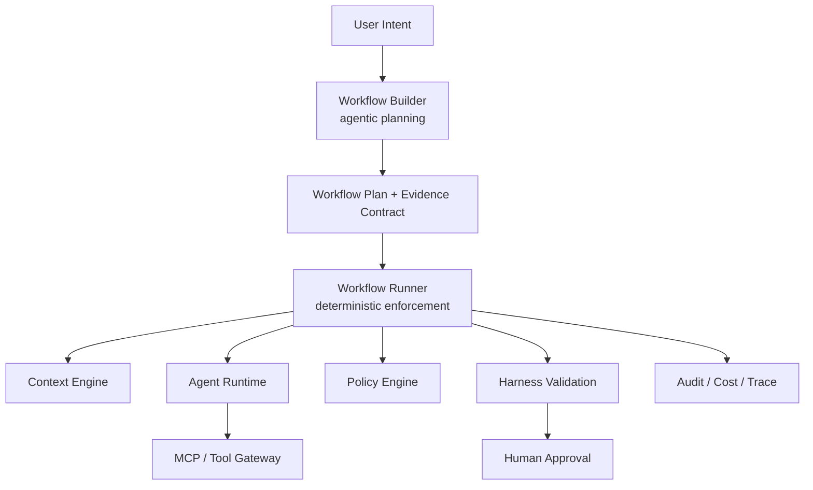
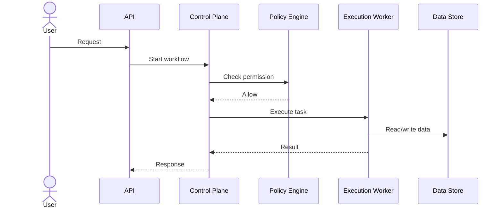

# Mermaid Templates

## Clean High-Level Architecture

```mermaid
flowchart TB
    U["Users / Clients"] --> API["API / Experience Layer"]
    API --> CP["Control Plane"]
    CP --> S1["Service A"]
    CP --> S2["Service B"]
    S1 --> DB1[("Database A")]
    S2 --> DB2[("Database B")]
    CP --> OBS["Observability"]
```

## Control Plane / Execution Plane

```mermaid
flowchart TB
    U["User / Request"] --> CP["Control Plane<br/>decides, validates, coordinates"]
    CP --> PE["Policy Engine"]
    CP --> WF["Workflow Runner"]
    WF --> EP["Execution Plane<br/>workers, agents, tools"]
    EP --> DATA["Data Plane"]
    CP --> AUDIT["Audit / Evidence"]
```

## Agentic AI Platform

```mermaid
flowchart TB
    U["User Intent"] --> WB["Workflow Builder<br/>agentic planning"]
    WB --> PLAN["Workflow Plan + Evidence Contract"]
    PLAN --> WR["Workflow Runner<br/>deterministic enforcement"]
    WR --> CE["Context Engine"]
    WR --> AG["Agent Runtime"]
    WR --> PE["Policy Engine"]
    WR --> HE["Harness Validation"]
    AG --> MCP["MCP / Tool Gateway"]
    HE --> HITL["Human Approval"]
    WR --> AUD["Audit / Cost / Trace"]
```

## Sequence Template

```mermaid
sequenceDiagram
    actor User
    participant API
    participant Control as Control Plane
    participant Policy as Policy Engine
    participant Worker as Execution Worker
    participant Store as Data Store

    User->>API: Request
    API->>Control: Start workflow
    Control->>Policy: Check permission
    Policy-->>Control: Allow
    Control->>Worker: Execute task
    Worker->>Store: Read/write data
    Worker-->>Control: Result
    Control-->>API: Response
```
